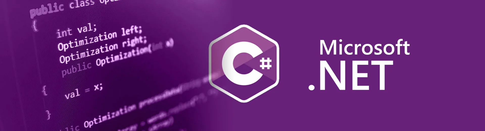

## Практика по курсу "Программирование" для ТФ

На этой странице размешены материалы по практической части курса "Программирование" для групп направления подготовки "Техническая физика". Основной язык курса C#.

### Организационный блок

- [Информация о преподавателе](./other/about_teacher.md)
- [Требования к оформлению отчёта по лабораторным работам](./other/report_requirements.md)

### Занятие по ТК1

- [Лабораторная работа №1](./labs/lab1.pdf)
