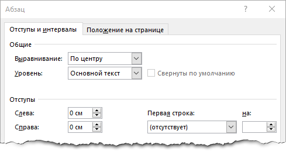
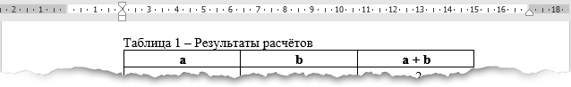

## Требования к оформлению отчёта по лабораторным работам

Все отчёты по лабораторным заданиям должны быть оформлены с соблюдением требований к оформлению перечисленных в этом разделе.

### Общие требования

Отчёт по лабораторной работе оформляется в соответствии с [шаблоном](./Шаблон_отчёта.docx) в любом редакторе и предоставляется на проверку в виде pdf файла. В итоговом варианте отчёт должен визуально соответствовать [примеру](./Пример_отчета.pdf).

На титульном листе указываются: номер работы, её название и ФИО обучающегося. Пункты **Цель** и **Постановка задачи** копируются из текста лабораторной работы без изменения. Далее нужно выполнить все задания перечисленные в тексте лабораторной работы и разместить всё, что требуется по заданию в отчёте, при этом номер выполняемого задания и его заголовок должны быть перенесены в отчёт. Чем подробнее в отчёте описан ход выполнения работы, тем лучше. Минимум один раз нужно указать номер варианта и задание соответствующее этому варианту. Пункт **Вывод** нужно писать в соответствии с целью.

При правильно выполненной работе и наличии в отчёте всех обязательных элементов, за работу выставляется оценка до 75 баллов. Оставшиеся 25 баллов выставляются за качество описания хода выполнения работы и наличие блок-схемы программы (или её важных фрагментов, в случае больших программ), в том случае, если блок-схема не является обязательным элементом по заданию.

### Рисунки

На рисунке не должно быть лишних элементов, таких как: фрагменты рабочего стола, посторонние окна, фрагменты интерфейса среды разработки и т.д., если этого не требуется по заданию. При необходимости уменьшайте размеры окон перед тем как делать скриншот, чтобы на них оставалась только нужная информация. Фрагменты экрана или окно можно захватить при помощи стандартных инструментов Windows - "Ножницы" или "Набросок на фрагменте экрана".

При изменении размера рисунка должны быть сохранены пропорции, то есть запрещается "сплющивать" или растягивать рисунок отдельно по высоте или ширине. Если рисунок небольшой, не нужно его растягивать, оставляйте оригинальные размеры.

Каждый рисунок снабжается подрисуночной подписью в соответствии с шаблоном:

```
Рис.[Номер рисунка] [Что изображено на рисунке]
```

Нумерация рисунков сквозная в пределах основного текста отчёта. В каждом приложении нумерация  начинается с единицы и перед номером рисунка добавляется символ `П` и номер приложения. Например:

```
Рис.1 Фрагмент программного кода
Рис.8 Окно программы
Рис.П1.1 Полный код программы
Рис.П5.4 Блок-схема программы
```

Рисунок и подрисуночная подпись размещаются в отдельном абзаце и выравниваются по центру страницы, при этом у них не должно быть отступов (распространённая ошибка).



### Таблицы

Каждая таблица снабжается поясняющей подписью в соответствии с шаблоном:

```
Таблица [Номер] - [Что в таблице]
```

Нумерация таблиц сквозная в пределах основного текста отчёта. В каждом приложении нумерация  начинается с начала и перед номером таблицы добавляется символ `П` и номер приложения. Например:

```
Таблица 1 - Результаты расчёта
Таблица 8 - Зависимость y от x
Таблица П1.1 - Частота слов в тексте
Таблица П5.4 - Таблица умножения
```

Таблица и подпись размещаются в отдельном абзаце, при этом у таблицы не должно быть отступов. Таблица выравнивается по центру страницы, а подпись выравнивается по левому краю <u>относительно таблицы</u>. Это можно сделать при помощи бегунка на линейке или в окне Абзац в поле отступ слева.



### Код

Исходный код размер которого превышает половину высоты страницы размещается в отдельном приложении, в противном случае код может быть размещён в тексте отчёта.

Код должен быть набран [моноширинным шрифтом](https://ru.wikipedia.org/wiki/Моноширинный_шрифт) (например Consolas) и иметь подсветку синтаксиса. Код может быть вставлен в виде текста, то есть путём копирования и вставки из среды разработки или в виде скриншота. В последнем случае, к коду предъявляются все требования, что и к обычному рисунку. В обоих случаях размер символов кода должен визуально соответствовать размеру основного текста, даже если реальный размер шрифта при этом отличается. Например: если основной текст написан Times New Roman 14pt, то для кода написанного шрифтом Consolas размер должен быть - 13pt.

### Блок схемы

Блок-схемы алгоритмов оформляются согласно [ГОСТ](./ГОСТ_19.701-90(ИСО_5807-85).pdf) и размещаются в конце отчёта в отдельных приложениях. В этих видео перечисляются [основные блоки](https://youtu.be/HqBuSyJEJNg) и [основные алгоритмические структуры](https://youtu.be/Pud6uA5tosk) применяемые при описании алгоритмов.

Создавать блок-схему можно как при помощи стандартных средств Word, рисовать в графических редакторах, так и использовать специализированные [сервисы](https://app.diagrams.net/) и [программы](http://dia-installer.de/).

В остальном, к блок-схемам предъявляются те же требования, как и к обычным рисункам.

